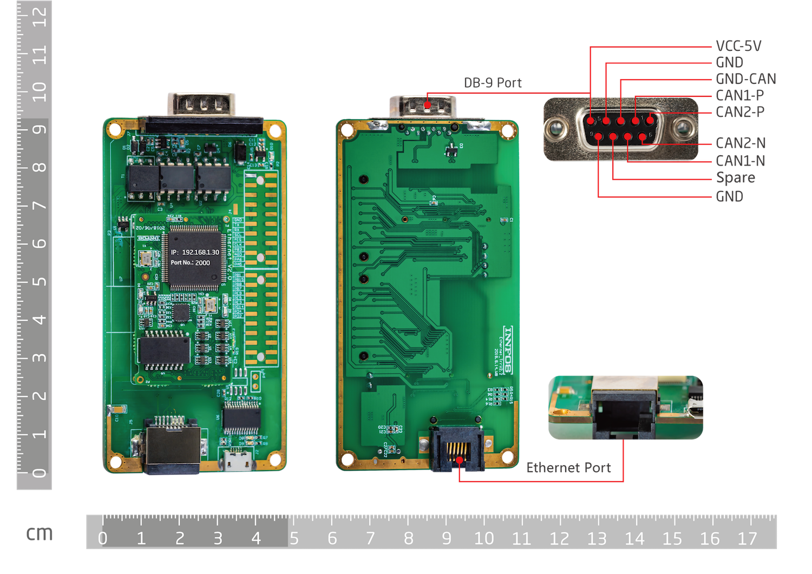

# ECB & HUB
## Introduction

The ECB is an Ethernet to CAN controller that acts as a bridge between Ethernet and CAN communication, with the STM32F429VET6 master chip and rich expansion interfaces. The Ethernet port is a standard RJ45 Ethernet interface, whose network speed is 10/100 Mbps and the default IP address is 192.168.1.30. The Ethernet communication protocol is UDP protocol, and the default port number is 2000. The ECB has two independent CAN buses and a CAN isolation scheme with a communication rate of 1 Mbps. The bandwidth of CAN communication can be increased through the two independent CAN buses, as well as the reduced communication delay, the increased real-time performance, and the control of a complex closed-loop system in which multiple actuators are connected in series can be realized.

ECB's schematic, BOM and Ethernet communication protocols are all open source and can be directly developed on the ECB according to users’ needs, greatly saving new products R&D time, thereby accelerating the time to go to the market.


 


## Functions

* CPU:STM32F429VET6
* RAM:256K
* Flash:512K
* 10/100M Ethernet：1
* CAN：2
* LEDs X12: Power Indicator LED X3, User LED X5, USB Transceiver Data LED X2, Link * activity LED X1, Link Speed LED X1
* Molex interface X6: CAN communication interface
* 2 rows of 2.54mm double row pins, including:
* I2C
* SPI
* USART
* Reserved master chip pin X29


 Note: 
The product power supply must not exceed the maximum input voltage; 
be stored in a dry environment, exposed to the sun, rain, falling, throwing and falling; be sensitive to static electricity, static electricity may cause permanent damage to the chip, the user is Before touching the product, it is best to let the static electricity carried by the body first, and then put it on the wall through the human body static eliminator or the hand for a while;

## Interface Description

### Core board pin definition
P1 pin definition
<table style="width:680px"><thead><tr class="tableizer-firstrow" style="background: PaleTurquoise; color: black"><th>P1 PIN#</th><th>Name</th><th>Alternate functions</th><th>P1 PIN#</th><th>Name</th><th>Alternate functions</th></tr></thead><tbody><tr><td>1</td><td>PC0</td><td>ADC123_IN10</td><td>2</td><td>PB1</td><td>ADC12_IN9<br>TIM1_CH3N<br>TIM3_CH4<br>TIM8_CH3N</td></tr><tr><td>3</td><td>PA15</td><td>TIM2_CH1/TIM2_ETR<br>SPI1_NSS<br>SPI3_NSS/I2S3_WS</td><td>4</td><td>PB15</td><td>TIM1_CH3N<br>TIM8_CH3N<br>SPI2_MOSI/I2S2_SD<br>TIM12_CH2</td></tr><tr><td>5</td><td>PB14</td><td>TIM1_CH2N<br>TIM8_CH2N<br>SPI2_MISO<br>I2S2ext_SD<br>TIM12_CH1</td><td>6</td><td>PB8</td><td>TIM4_CH3<br>TIM10_CH1<br>I2C1_SCL<br>CAN1_RX<br>ETH_MII_TXD3</td></tr> <tr><td>7</td><td>PE10</td><td>TIM1_CH2N</td><td>8</td><td>PB7</td><td>TIM4_CH2<br>I2C1_SDA<br>USART1_RX</td></tr><tr><td>9</td><td>PE8</td><td>TIM1_CH1N<br>UART7_Tx</td><td>10</td><td>PE9</td><td>TIM1_CH1</td></tr><tr><td>11</td><td>PE4</td><td>SPI4_NSS</td><td>12</td><td>PE5</td><td>TIM9_CH1<br>SPI4_MISO</td></tr><tr><td>13</td><td>PD15</td><td>TIM4_CH4</td><td>14</td><td>PE3</td><td>TRACED0</td></tr><tr><td>15</td><td>PD13</td><td>TIM4_CH2</td><td>16</td><td>PD14</td><td>TIM4_CH3</td></tr><tr><td>17</td><td>PD3</td><td>SPI2_SCK/I2S2_CK</td><td>18</td><td>PD4</td><td>USART2_RTS</td></tr><tr><td>19</td><td>PD1</td><td>CAN1_TX</td><td>20</td><td>PD2</td><td>TIM3_ETR<br>UART5_RX</td></tr></tbody></table>


P2 pin definition
<table style="width:680px"><thead><tr class="tableizer-firstrow" style="background: PaleTurquoise; color: black"><th>P1 PIN#</th><th>Name</th><th>Alternate functions</th><th>P1 PIN#</th><th>Name</th><th>Alternate functions</th></tr></thead><tbody><tr><td>1</td><td>PA5</td><td>ADC12_1N5<<br>TIM2_CH1/TIM2_ETR<br>TIM8_CH1N<br>SPI1_SCK</td><td>2</td><td>PA3</td><td>ADC123_IN3<br>TIM2_CH4<br>TIM5_CH4<br>TIM9_CH2<br>USART2_RX</td></tr><tr><td>3</td><td>PA6</td><td>ADC12_IN6<br>TIM1_BKIN<br>TIM3_CH1<br>TIM8_BKIN<br>SPI1_MISO<br>TIM13_CH1</td><td>4</td><td>PA4</td><td>ADC12_1N4/DAC_OUT1<br>SPI1_NSS<br>SPI3_NSS/I2S3_WS</td></tr><tr><td>5</td><td>AGND</td><td>&nbsp;</td><td>6</td><td>PA0</td><td>ADC123_IN0/WKUP<br>TIM2_CH1/TIM2_ETR<br>TIM5_CH1<br>TIM8_ETR<br>UART4_TX<br>ETH_MII_CRS</td></tr><tr><td>7</td><td>PB3</td><td>TIM2_CH2<br>SPI1_SCK<<br>SPI3_SCK/I2S3_CK</td><td>8</td><td>PB4</td><td>TIM3_CH1<br>SPI1_MISO<br>SPI3_MISO<br>I2S3ext_SD</td></tr><tr><td>9</td><td>PD3</td><td>SPI2_SCK/I2S2_CK</td><td>10</td><td>PB9</td><td>TIM4_CH4<br>TIM11_CH1<br>I2C1_SDA<br>SPI2_NSS/I2S2_WS<br>CAN1_TX</td></tr><tr><td>11</td><td>PI2</td><td>TIM8_CH4<br>SPI2_MISO<br>I2S2ext_SD</td><td>12</td><td>PI3</td><td>TIM8_ETR<br>SPI2_MOSI/I2S2_SD</td></tr><tr><td>13</td><td>PA8</td><td>TIM1_CH1<br>I2C3_SCL</td><td>14</td><td>PC9</td><td>TIM3_CH4<br>TIM8_CH4<br>I2C3_SDA<br>I2S_CKIN</td></tr><tr><td>15</td><td>PD6</td><td>SPI3_MOSI/I2S3_SD<br>USART2_RX</td><td>16</td><td>VCC_5V</td><td>&nbsp;</td></tr><tr><td>17</td><td>PD5</td><td>USART2_TX</td><td>18</td><td>PB0</td><td>TIM1_CH2N<br>TIM3_CH3<br>TIM8_CH2N<br>ETH_MII_RXD2</td></tr><tr><td>19</td><td>GND</td><td>&nbsp;</td><td>20</td><td>PC7</td><td>TIM3_CH2<br>TIM8_CH2<br>I2S3_MCK<br>USART6_RX</td></tr></tbody></table>


### Amass XT60、molex、MicroUSB、Network port
Amass XT60：power input

Molex：communication interface，CAN1-J1、J2、J3；CAN2-J4、J5、J6

MicroUSB：USB function interface reserved

Network port: connect the host computer


## Dimensions

 


## How to connect ECB and ECB_HUB

Method 1:


Method 2:


## Connect multiple ECBs


Note: When multiple ECBs are connected to the same computer, the IP and MAC addresses of the ECB cannot be duplicated. Modify the IP and MAC addresses of the ECB,please modify the IP and MAC addresses.

## Modify IP and MAC address
#### •	download


*   Visit the link[download link](https://github.com/innfos/ipChangeTool .git)o download the SDK related files or execute the following command directly

```sh
$ git clone https://github.com/innfos/ipChangeTool.git
```
    
2.  Enter the ipChangeTool directory and modify the permissions of ipChange:

```sh
chmod 777 ipChange
```
3.  It is confirmed that there is only one ECB or ECU connected to the computer and powered up, and then execute the command:

```sh
./ipChange -ip=<1~255> -mac=<1~255>
```
*   Please note that only the last number of IP or MAC addresses can be modified, for example, the IP address of the ECB is 192.168.1.30, and only 30 can be modified to other number.

## •	Resource
* [Schematic 1]( ../img/Ethernet_TransferV2.2SCH.pdf.zip ) [Schematic 2]( ../img/HUBV3.0SCH.pdf.zip )
* [Dimensional Drawing 1]( ../img/Ethernet_TransferV2.2.zip ) [Dimensional Drawing 2]( ../img/HUBV3.0.zip )
* [STM32F429 data sheet]( ../img/STM32F429.pdf.zip )


## Version updating records
<table class="tableizer-table">
<thead><tr class="tableizer-firstrow" style="background: PaleTurquoise; color: black;width:500px"><th >Version</th><th>Update time</th><th>Content</th></tr></thead><tr><td>V1.0.0</td><td>2019-05</td><td>the first version</td></tr></tbody></table>
