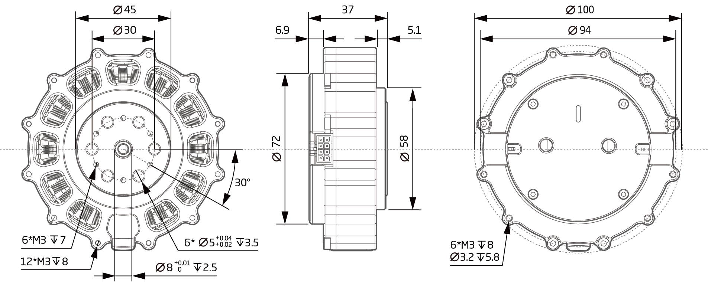

# Parameter introduction 
## QDD-NU80-6 Parameter Diagram[mm]
 
### 3D model 
[Model file ]( ../img/QDD-NU80-6_v3_3.step.zip )

## QDD-NU80-6 Parameter
<table style="width:850px"><thead><tr><th colspan="4" style="background: PaleTurquoise; color: black;">QDD-NU80-6 parameter</th></tr></thead><tbody><tr><td colspan="2" width=60%><b>Working parameters at norminal voltage</b></td><td colspan="2" width=40%><b>Mechanical parameters</b></td></tr><tr><td>Motor power</td><td>250 W</td><td>Diameter</td><td>100mm</td></tr><tr><td>Norminal voltage</td><td>42 VDC</td><td>Length</td><td>37mm</td></tr><tr><td>No load speed</td><td>366.67 RPM</td><td>Weight</td><td>453.1 g</td></tr><tr><td>Norminal speed</td><td>250 RPM</td><td>Backlash</td><td>9 Arc min</td></tr><tr><td>Nominal torque</td><td>6.6 Nm</td><td>Static load capacity</td><td>1270N</td></tr><tr><td>Peak torque</td><td>19.8 Nm</td><td>Version number</td><td>v3.3</td></tr><tr><td>Torque coefficient</td><td>0.6 Nm/A</td><td colspan="2"><b>Work area</b></td></tr><tr><td>Full range of phase current</td><td>33A</td><td colspan="2" rowspan="15"></td></tr><tr><td>Nominal power current</td><td>12 A</td></tr><tr><td>Quiescent Current</td><td>0.08 A</td></tr><tr><td colspan="2"><b>Basic parameters</b></td></tr><tr><td>Motor type</td><td>Brushless servo motor</td></tr><tr><td>Voltage range</td><td>24~45 VDC</td></tr><tr><td>Gear ratio</td><td>6:1</td></tr><tr><td>Resolution</td><td>98304 (16 bit)Step/turn </td></tr><tr><td>Encoder system</td><td>Multiturn absoulute encoder （±127turns）</td></tr><tr><td>Interface</td><td>CAN</td></tr><tr><td>Angle of rotation</td><td>> 360.0 °</td></tr><tr><td>Ambient temperature range</td><td>5~55 °C</td></tr><tr><td>Noise level</td><td><= 70 dB(A)</td></tr></tbody></table>

 Note: Encoder counter range: ±127turns; Motor protection temperature settable range: 25-120 °C; Inventer protection temperature settable range: 25-120 °C

### Connector Pin Layout
<table class="tableizer-table">
<thead><tr class="tableizer-firstrow"><th colspan="4" style="background: PaleTurquoise; color: black;width:800px">Connector Pin Layout</th></tr></thead><tbody><tr><td>Pin NO.</td><td>Color</td><td>Signal</td><td>Terminal pin distribution</td></tr><tr><td>1</td><td>PVDD</td><td>Black</td><td rowspan="9"></td></tr><tr><td>3</td><td>PVDD</td><td>Black</td></tr><tr><td>5</td><td>PVDD</td><td>Black</td></tr><tr><td>2</td><td>GND</td><td>Black</td></tr><tr><td>4</td><td>GND</td><td>Black</td></tr><tr><td>6</td><td>CAN-GND</td><td>Gray</td></tr><tr><td>7</td><td>CAN-L</td><td>Gray</td></tr><tr><td>8</td><td>CAN-H</td><td>Gray</td></tr></tbody></table>

## Version Updating Records

<table style="width:600px"><thead><tr style="background:PaleTurquoise"><th style="width:80px">Version number</th><th style="width:100px">Update time</th><th style="width:100px">Type </th><th style="width:80px">Location</th><th>Update content</th></tr></thead><tbody><tr><td>V3.3.0 </td><td>2019.06.30</td><td>Add</td><td>QDD-NU80-6</td><td>Full text added</th></tr></thead><tbody><tr><td><a href="http://innfos.com/wiki/en/index.html#!pages/QDD-NU80-6_v3_2.md">V3.2.0 </a> </td><td>2019.06.06</td><td>Add</td><td>QDD-NU80-6</td><td>Full text added</th></tr></thead><tbody><tr><td><a href="http://innfos.com/wiki/en/index.html#!pages/QDD-NU80-6_v3_1.md">V3.1.0 </a></td><td>2019.05.28</td><td>Add</td><td>QDD-NU80-6</td><td>Full text added</th></tr></thead><tbody><tr><td><a href="http://innfos.com/wiki/en/index.html#!pages/QDD-NU80-6_v3_0.md">V3.0.0 </a></td><td>2019.05.22</td><td>Add</td><td>QDD-NU80-6</td><td>Full text added</th></tr></thead><tbody><tr><td><a href="http://innfos.com/wiki/en/index.html#!pages/QDD-NU80-6_v2_2.md">V2.2.0 </a></td><td>2019.05.09</td><td>Add</td><td>QDD-NU80-6</td><td>Full text added</th></tr></thead><tbody><tr><td>V1.0.0</td><td>2019.04.11</td><td>Add</td><td>QDD-NU80-6</td><td>Full text added</td></tbody></table>
