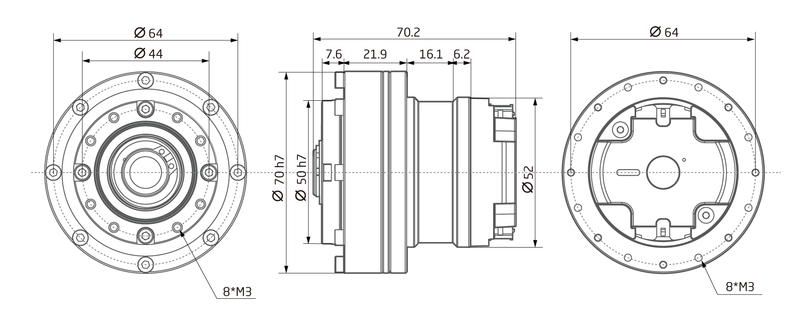

# Parameter introduction 
## QDD Pro-3510-80 Parameter Diagram[mm]

### 3D model 
[Model file]( ../img/QDD_Pro-3510-80-70_v2_2.step.zip )

## QDD Pro-3510-50parameter
Note:The harmonic flexible wheel is fixed, so the actual deceleration ratio is 1 plus harmonic nominal deceleration ratio.

<table style="width:700px"><thead><tr><th colspan="4" style="background: PaleTurquoise; color: black;">QDD Pro-3510-80parameter</th></tr></thead><tbody><tr><td colspan="2" width=50%><b>Working parameters at rated voltage</b></td><td colspan="2" width=50%><b>Mechanical parameters</b></td></tr><tr><td>Motor power</td><td>200 W</td><td>Diameter</td><td>70mm</td></tr><tr><td>Norminal voltage</td><td>42 VDC</td><td>Length</td><td>70.2mm</td></tr><tr><td>No load speed</td><td>74.1 RPM</td><td>Weight</td><td>0.9 Kg</td></tr><tr><td>Norminal speed</td><td>43.2 RPM</td><td>Maximum axial load</td><td>  N</td></tr><tr><td>Nominal torque</td><td>10.5 Nm</td><td>Maximum radial load</td><td>  N</td></tr><tr><td>Peak torque</td><td>45 Nm</td><td>Version number</td><td>v2.2</td></tr><tr><td>Torque coefficient</td><td>4.9086 Nm/A</td><td colspan="2"><b>Work area</b></td></tr><tr><td>Full range of phase current</td><td>16.5A</td><td colspan="2" rowspan="15"></td></tr><tr><td>Nominal power current</td><td>4.8 A</td></tr><tr><td>Quiescent Current</td><td>0.08 A</td></tr><tr><td colspan="2"><b>Basic parameters</b></td></tr><tr><td>Motor type</td><td>
Brushless servo motor</td></tr><tr><td>Voltage range</td><td>24~45 VDC</td></tr><tr><td>Gear ratio</td><td>81：1</td></tr><tr><td>Resolution</td><td>1327104(20bit) Step/turn</td></tr><tr><td>Position accuracy</td><td><=10 Arc sec</td></tr><tr><td>Sensor system</td><td>Multiloop absoulute encoder</td></tr><tr><td>Interface</td><td>CAN</td></tr><tr><td>Angle of rotation</td><td>> 360.0 °</td></tr><tr><td>Temperature range</td><td>5~55 °C</td></tr><tr><td>Niose level</td><td><= 70 dB(A)</td></tr></tbody></table>
	

### Connector Pin Layout
<table class="tableizer-table">
<thead><tr class="tableizer-firstrow"><th colspan="4" style="background: PaleTurquoise; color: black;">Connector Pin Layout</th></tr></thead><tbody><tr><td>Pin NO.</td><td>Color</td><td>Signal</td><td>Terminal pin distribution</td></tr><tr><td>1</td><td>PVDD</td><td>Black</td><td rowspan="9"></td></tr><tr><td>3</td><td>PVDD</td><td>Black</td></tr><tr><td>5</td><td>PVDD</td><td>Black</td></tr><tr><td>2</td><td>GND</td><td>Black</td></tr><tr><td>4</td><td>GND</td><td>Black</td></tr><tr><td>6</td><td>CAN-GND</td><td>Gray</td></tr><tr><td>7</td><td>CAN-L</td><td>Gray</td></tr><tr><td>8</td><td>CAN-H</td><td>Gray</td></tr></tbody></table>

# Version Information
<table class="tableizer-table">
<thead><tr class="tableizer-firstrow"></thead><tbody>
 <tr><td>version</td><td>date</td><td>Modify content</td></tr>
 <tr><td>V2.2.0</td><td>2019-05-09</td><td>Current version</td></tr>
 <tr><td>V1.0.0</td><td>2019-04</td><td>The first version</td></tr>
</tbody></table>
