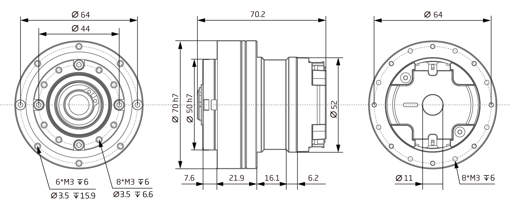
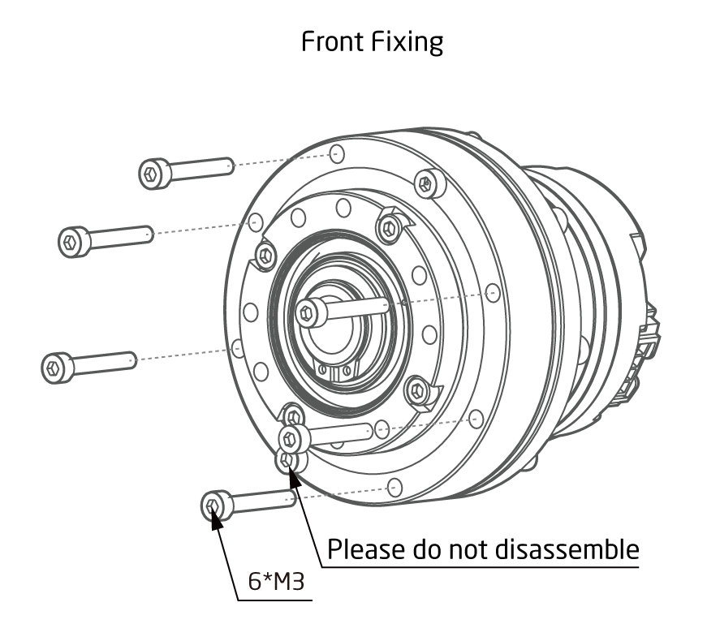

# Parameter introduction
## QDD Pro-NE30-50-70 Parameter Diagram[mm]

**Usage and Installation description**

*  Front Fixing and Rear Fixing

 
### 3D model
[Model file]( ../img/QDD_Pro-NE30-x-70_v2_2.step.zip )

## QDD Pro-NE30-50-70 Parameter

Note:The actual reduction ratio is the harmonic nomical gear ratio plus 1 because the flexspline is fixed.

<table style="width:650px"><thead><tr><th colspan="4" style="background: PaleTurquoise; color: black;">QDD Pro-NE30-50-70 parameter</th></tr></thead><tbody><tr><td colspan="2"><b>Working parameters at norminal voltage</b></td><td colspan="2"><b>Basic parameters</b></td></tr><tr><td style="width:175px">Motor power</td><td style="width:135px">200 W</td><td style="width:130px"rowspan="2">Resolution</tdrowspan="2"><td style="width:220px"rowspan="2">835584(19bit) Step/turn</tdrowspan="2"></tr><tr><td>Norminal voltage</td><td>42 VDC</td></tr><tr><td>No load speed</td><td>117.6 RPM</td><td>Interface</td><td>Isolated CAN</td></tr><tr><td>Norminal speed</td><td>68.6 RPM</td><td>Angle of rotation</td><td>> 360.0 °</td></tr><tr><td>Nominal torque</td><td>6.6 Nm</td><td>Ambient temperature range</td><td>5~55 °C</td></tr><td>Peak torque</td><td>33 Nm</td><td>Noise level</td><td><= 70 dB(A)</td></tr><tr><td>Torque coefficient</td><td>1.7748 Nm/A</td><td colspan="2"><b>Mechanical parameters</b></td></tr><tr><td>Full range of phase current</td><td>16.5A</td><td style="width:175px">Diameter</td><td style="width:175px">70mm</td></tr><tr><td>Nominal power current</td><td>4.8 A</td><td>Length</td><td>70.2mm</td></tr><tr><td>Quiescent Current</td><td>0.08 A</td><td>Weight</td><td>561.7 g</td></tr> <tr><td colspan="2"><b>Basic parameters</b></td><td>Backlash</td><td><=20 Arc sec</td></tr><tr><td>Motor type</td><td>Brushless servo motor</td><td>Maximum axial load</td><td>830N</td></tr><tr><td>Voltage range</td><td>24~45 VDC</td><td>Maximum radial load</td><td>830N</td></tr><tr><td>Gear ratio</td><td>51:1</td><td>Version number</td><td>v2.2</td></tr></tbody></table>

 Note: Encoder counter range: ±127turns; Motor protection temperature settable range: 25-120 °C; Inverter protection temperature settable range: 25-120 °C

### Connector Pin Layout

#### Interface specification

## Version Updating Records

<table style="width:600px"><thead><tr style="background:PaleTurquoise"><th style="width:100px">Version number</th><th style="width:150px">Update time</th><th style="width:3800px">Update content</th></tr></thead><tbody><tr><td>v2.2.1</td><td>2019.07.03</td><td>Updated the values of rated torque  Updated the values of peak torque  Updated the values of maximum load  Updated installation instructions</th></tr></thead><tbody><tr><td>v2.2.0</td><td>2019.05.09</td><td>Full text added</th></tr></thead><tbody><tr><td>v1.0.0</td><td>2019.04.11</td><td>Full text added</td></tbody></table>
