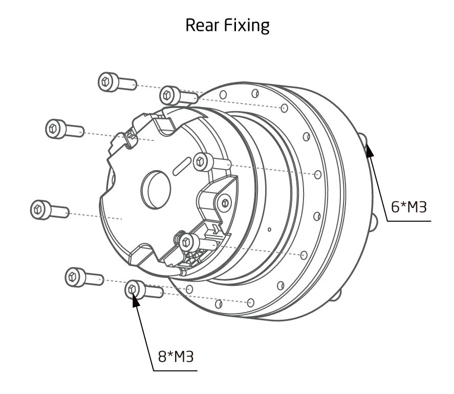

# Parameter introduction 
## QDD Pro-NE30-80 Parameter Diagram[mm]

**Usage and Installation description**

*  Front Fixing and Rear Fixing

 
### 3D model 
[Model file]( ../img/QDD_Pro-NE30-x-70_v2_2.step.zip )

## QDD Pro-NE30-80parameter
Note:The harmonic gear drive is fixed by the flexible wheel, so the actual gear ratio is the harmonic nominal gear ratio plus 1.

<table style="width:850px"><thead><tr><th colspan="4" style="background: PaleTurquoise; color: black;">QDD Pro-NE30-80 parameter</th></tr></thead><tbody><tr><td colspan="2" width=60%><b>Working parameters at norminal voltage</b></td><td colspan="2" width=40%><b>Mechanical parameters</b></td></tr><tr><td>Motor power</td><td>200 W</td><td>Diameter</td><td>70mm</td></tr><tr><td>Norminal voltage</td><td>42 VDC</td><td>Length</td><td>70.2mm</td></tr><tr><td>No load speed</td><td>74.1 RPM</td><td>Weight</td><td>561.7g</td></tr><tr><td>Norminal speed</td><td>43.2 RPM</td><td>acklash</td><td><=10 Arc sec</td></tr><tr><td>Nominal torque</td><td>10.5 Nm</td><td>Maximum axial load</td><td> 830N</td></tr><tr><td>Peak torque</td><td>45 Nm</td><td>Maximum radial load</td><td>  830N</td></tr><tr><td>Torque coefficient</td><td>2.8188 Nm/A</td><td>Version number</td><td>v2.2</td></tr><tr><td>Full range of phase current</td><td>16.5A</td><td colspan="2"><b>Work area</b></td></tr><tr><td>Nominal power current</td><td>4.8 A</td><td colspan="2" rowspan="15"></td></tr><tr><td>Quiescent Current</td><td>0.08 A</td></tr><tr><td colspan="2"><b>Basic parameters</b></td></tr><tr><td>Motor type</td><td>Brushless servo motor</td></tr><tr><td>Voltage range</td><td>24~45 VDC</td></tr><tr><td>Gear ratio</td><td>81:1</td></tr><tr><td>Resolution</td><td>1327104(20bit) Step/turn</td></tr><tr><td>Sensor system</td><td>Multiturn absoulute encoder （±127turns）</td></tr><tr><td>Interface</td><td>CAN</td></tr><tr><td>Angle of rotation</td><td>> 360.0 °</td></tr><tr><td>Temperature range</td><td>5~55 °C</td></tr><tr><td>Noise level</td><td><= 70 dB(A)</td></tr></tbody></table>

### Connector Pin Layout

#### Interface specification

Power signal composite interface: Molex 430450827

<table class="tableizer-table"><thead><tr class="tableizer-firstrow"><th colspan="4" style="background: PaleTurquoise; color: black;">Connector Pin Layout</th></tr></thead><tbody><tr><td>Pin NO.</td><td>Color</td><td>Signal</td><td>Terminal pin distribution</td></tr><tr><td>1</td><td>PVDD</td><td>Black</td><td rowspan="9"></td></tr><tr><td>3</td><td>PVDD</td><td>Black</td></tr><tr><td>5</td><td>PVDD</td><td>Black</td></tr><tr><td>2</td><td>GND</td><td>Black</td></tr><tr><td>4</td><td>GND</td><td>Black</td></tr><tr><td>6</td><td>CAN-GND</td><td>Gray</td></tr><tr><td>7</td><td>CAN-L</td><td>Gray</td></tr><tr><td>8</td><td>CAN-H</td><td>Gray</td></tr></tbody></table>

## Version Updating Records

<table style="width:400px"><thead><tr style="background:PaleTurquoise"><th style="width:100px">Version number</th><th style="width:150px">Update time</th><th style="width:3800px">Update content</th></tr></thead><tbody><tr><td>v2.2.1</td><td>2019.07.03</td><td>Updated the values of rated torque  Updated the values of peak torque  Updated the values of maximum load  Updated installation instructions</th></tr></thead><tbody><tr><td>v2.2.0</td><td>2019.05.09</td><td>Full text added</th></tr></thead><tbody><tr><td>v1.0.0</td><td>2019.04.11</td><td>Full text added</td></tbody></table>
