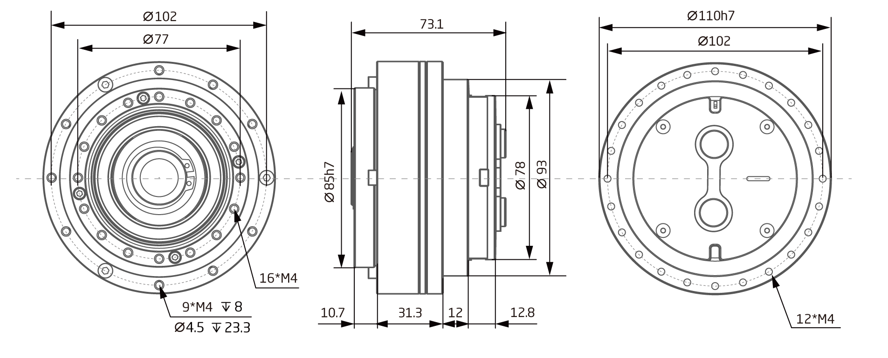
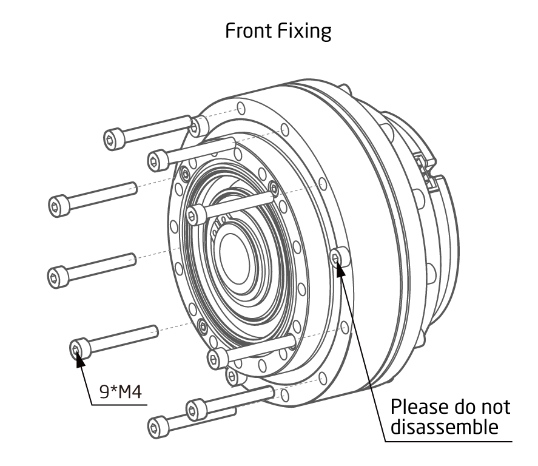
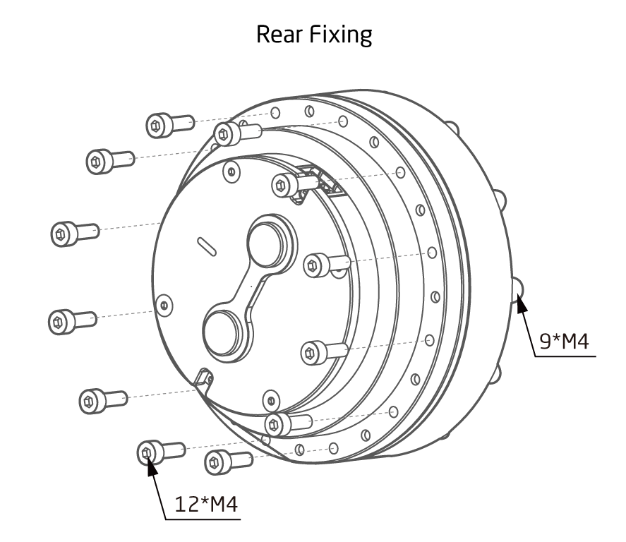

# Parameter introduction
## QDD Pro-NU80-80-110 Parameter Diagram[mm]

**Usage and Installation description**

*   Front Fixing and Rear Fixing

 
### 3D model
[Model file]( ../img/QDD_Pro-NU80-x-110_v2_2.step.zip )

## QDD Pro-NU80-80-110 Parameter

Note:The actual reduction ratio is the harmonic nomical gear ratio plus 1 because the flexspline is fixed.

<table style="width:650px"><thead><tr><th colspan="4" style="background: PaleTurquoise; color: black;">QDD Pro-NU80-80-110parameter</th></tr></thead><tbody><tr><td colspan="2"><b>Working parameters at norminal voltage</b></td><td colspan="2"><b>Basic parameters</b></td></tr><tr><td style="width:175px">Motor power</td><td style="width:135px">500 W</td><td style="width:130px">Resolution</td><td style="width:220px">1310720(20bit)  Step/turn</td></tr><tr><td>Norminal voltage</td><td>42 VDC</td><td style="width:130px">Encoder system</td><td style="width:220px">Multiturn absoulute encoder</td></tr><tr><td>No load speed</td><td>27.2 RPM</td><td>Interface</td><td>Isolated CAN</td></tr><tr><td>Norminal speed</td><td>18.5 RPM</td><td>Angle of rotation</td><td>> 360.0 °</td></tr><tr><td>Nominal torque</td><td>83 Nm</td><td>Ambient temperature range</td><td>5~55 °C</td></tr><td>Peak torque</td><td>242 Nm</td><td>Noise level</td><td><= 70 dB(A)</td></tr><tr><td>Torque coefficient</td><td>8.1 Nm/A</td><td colspan="2"><b>Mechanical parameters</b></td></tr><tr><td>Full range of phase current</td><td>33A</td><td style="width:175px">Diameter</td><td style="width:175px">110mm</td></tr><tr><td>Nominal power current</td><td>12 A</td><td>Length</td><td>73.1mm</td></tr><tr><td>Quiescent Current</td><td>0.08 A</td><td>Weight</td><td>1700 g</td></tr> <tr><td colspan="2"><b>Basic parameters</b></td><td>Backlash</td><td><=10 Arc sec</td></tr><tr><td>Motor type</td><td>Brushless servo motor</td><td>Maximum axial load</td><td>2800N</td></tr><tr><td>Voltage range</td><td>24~45 VDC</td><td>Maximum radial load</td><td>2800N</td></tr><tr><td>Gear ratio</td><td>81:1</td><td>Version number</td><td>v2.2</td></tr></tbody></table>

 Note: Encoder counter range: ±127turns; Motor protection temperature settable range: 25-120 °C; Inverter protection temperature settable range: 25-120 °C

### Connector Pin Layout

### Terminal pin function

<table class="tableizer-table" style="width:390px">
 <thead><tr class="tableizer-firstrow"><th colspan="4" style="background: PaleTurquoise; color: black;">Terminal pin function</th></tr></thead><tbody><tr><td>Label</td><td>Signal</td><td>colour</td><td>Features </td></tr><tr><td>1</td><td>PVDD</td><td>Black</td><td rowspan="3">Positive power supply </td></tr><tr><td>3</td><td>PVDD</td><td>Black</td></tr><tr><td>5</td><td>PVDD</td><td>Black</td></tr><tr><td>2</td><td>GND</td><td>Black</td> <td rowspan="2">Power supply grounding</td></tr><tr><td>4</td><td>GND</td><td>Black</td></tr><tr><td>6</td><td>CAN-GND</td><td>Gray</td><td>CAN communication signal ground</td></tr><tr><td>7</td><td>CAN-L</td><td>Gray</td><td>CAN communication low signal line</td></tr><tr><td>8</td><td>CAN-H</td><td>Gray</td><td>CAN communication high signal line</td></tr></tbody></table>
 </tbody></table>
## Version Updating Records

<table style="width:400px"><thead><tr style="background:PaleTurquoise"><th style="width:100px">Version number</th><th style="width:150px">Update time</th><th style="width:150px">Update content</th></tr></thead><tbody><tr><td>V2.2.0</td><td>2019.05.09</td><td>Full text added</th></tr></thead><tbody><tr><td>V1.0.0</td><td>2019.04.11</td><td>Full text added</td></tbody></table>
